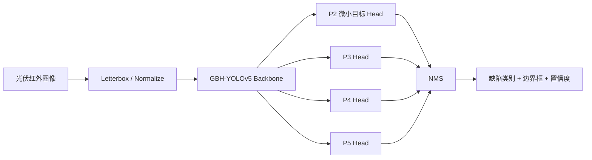

# PV Infrared Defect Detection

[](https://www.python.org/)
[](https://pytorch.org/)
[](LICENSE)


面向光伏电站红外巡检的 **GBH-YOLOv5** 缺陷检测推理包。模型针对红外图像中的小目标和细长目标进行优化，可识别划痕、热点、破损、黑边和不发电五类缺陷。

> [!IMPORTANT]
> **测试数据集和训练好的 `best.pt` 模型不包含在本仓库中。**
> 请发送邮件至 **ljonjon540122@gmail.com** 获取，邮件主题建议使用：
> `[PV Defect] Request test dataset and inference model`
>
> 邮件中请简要说明姓名／单位、使用场景，以及不会未经授权再次分发数据或模型。

## ✨ 项目亮点

- **GBH-YOLOv5 结构**：GhostConv、BottleneckCSP 与微小目标预测头组合，面向光伏红外小目标检测。
- **四尺度检测头**：在常规 P3/P4/P5 基础上增加 P2/4 微小目标分支。
- **五类缺陷识别**：同时输出缺陷类别、边界框和置信度。
- **多种输入方式**：支持单图、图片目录、视频、网络流和摄像头。
- **现代环境兼容**：包含 PyTorch 2.x 与 NumPy 兼容修正，适用于当前主流训练环境。
- **可导出部署**：保留 TorchScript、ONNX 和 CoreML 导出入口。

## 🧠 检测架构



核心结构：

- **Backbone**：`Focus`、`GhostConv`、`BottleneckCSP`、`SPP`。
- **Neck/Head**：多尺度特征融合与四尺度 `Detect` 层。
- **输入分辨率**：默认 `640 × 640`。
- **模型配置**：`models/yolov5s_pv.yaml`。

## 🏷️ 检测类别

| ID | 类别 | 中文说明 | 运维意义 |
|---:|---|---|---|
| 0 | `scratch` | 划痕 | 表面细长损伤，影响组件完整性 |
| 1 | `hot_spot` | 局部热点 | 严重安全隐患，建议优先处理 |
| 2 | `broken` | 破碎／物理损伤 | 组件结构受损，可能影响发电 |
| 3 | `black_border` | 黑边／边缘异常 | 常见于边缘过热或封装异常 |
| 4 | `no_electricity` | 不发电／组串异常 | 可能导致明显功率损失 |

## 📂 仓库结构

```text
.
├── data/
│   ├── convert_pv.py              # VOC XML → YOLO 标签转换
│   ├── pv_thermal.yaml            # 五类数据配置
│   └── README.md
├── models/
│   ├── common.py
│   ├── experimental.py
│   ├── export.py
│   ├── yolo.py
│   └── yolov5s_pv.yaml            # PV 专用四尺度模型配置
├── utils/
│   ├── datasets.py
│   ├── general.py
│   ├── plots.py
│   └── ...
├── test_images/JPEGImages/         # 测试图片放入此处（默认不提交）
├── weights/                        # best.pt 放入此处（默认不提交）
├── detect.py                       # 推理入口
├── requirements.txt
├── THIRD_PARTY_NOTICES.md
└── LICENSE
```

## 🔐 数据与模型获取

当前仓库不公开分发以下内容：

- 光伏红外测试图片；
- 训练好的 `weights/best.pt`；
- 其他可能包含第三方数据授权限制的文件。

获取方式：

1. 发送邮件至 **ljonjon540122@gmail.com**；
2. 主题：`[PV Defect] Request test dataset and inference model`；
3. 简要说明使用目的、单位和联系方式；
4. 获得授权后，将文件和模型放入对应目录。

> 原始数据集来自 CCNUZFW 的 `PV-Multi-Defect` 数据集，学术使用时请引用论文，详见 [THIRD_PARTY_NOTICES.md](THIRD_PARTY_NOTICES.md)。

## ⚙️ 环境配置

推荐环境：

| 组件 | 推荐配置 |
|---|---|
| 操作系统 | Linux / Windows |
| Python | 3.10 / 3.11 |
| PyTorch | 2.x |
| CUDA | 11.x - 12.x；当前交付环境为 CUDA 12.8 |
| GPU | 推荐 NVIDIA GPU；CPU 可运行但速度较慢 |

安装依赖：

```bash
pip install -r requirements.txt
```

如需指定 PyTorch 的 CUDA 版本，请先按照 [PyTorch 官方说明](https://pytorch.org/get-started/locally/) 安装对应版本，再安装其余依赖。

## 🚀 快速开始

### 1. 放入模型

将邮件获取的模型放到：

```text
weights/best.pt
```

### 2. 放入测试图片

将待检测的红外图片放入：

```text
test_images/JPEGImages/
```

### 3. 执行推理

```bash
python detect.py
```

也可以显式指定模型和输入目录：

```bash
python detect.py \
  --weights weights/best.pt \
  --source test_images/JPEGImages \
  --img-size 640 \
  --conf-thres 0.25 \
  --device 0
```

CPU 推理：

```bash
python detect.py --weights weights/best.pt --source test_images/JPEGImages --device cpu
```

## 🧰 常用命令

只检测热点：

```bash
python detect.py --weights weights/best.pt --source test_images/JPEGImages --classes 1
```

同时保存标注文本：

```bash
python detect.py --weights weights/best.pt --source test_images/JPEGImages --save-txt --save-conf
```

指定输出目录：

```bash
python detect.py --weights weights/best.pt --source test_images/JPEGImages --project runs/detect --name pv_demo
```

## 🎛️ 参数说明

| 参数 | 默认值 | 说明 |
|---|---|---|
| `--weights` | `weights/best.pt` | 训练模型权重 |
| `--source` | `test_images/JPEGImages` | 图片、目录、视频、网络流或摄像头索引 |
| `--img-size` | `640` | 推理分辨率 |
| `--conf-thres` | `0.25` | 置信度阈值 |
| `--iou-thres` | `0.45` | NMS IoU 阈值 |
| `--device` | 自动 | `0`、`0,1` 或 `cpu` |
| `--classes` | 全部 | 按类别 ID 过滤 |
| `--save-txt` | 关闭 | 保存 YOLO 格式检测结果 |
| `--save-conf` | 关闭 | 在文本结果中附加置信度 |
| `--project` | `runs/detect` | 结果根目录 |
| `--name` | `exp` | 实验输出目录名 |

## 📦 数据转换

原始数据采用 PASCAL VOC XML 标注。将数据准备为以下结构：

```text
data/images/PV-Multi-Defect/
├── Annotations/
└── JPEGImages/
```

执行：

```bash
python data/convert_pv.py
```

转换后生成：

```text
datasets/pv_data/
├── images/train/
├── images/val/
├── labels/train/
└── labels/val/
```

转换脚本使用固定随机种子 `42`，默认按 80% / 20% 划分训练集和验证集。

## 📤 输出结果

默认输出目录为：

```text
runs/detect/exp/
```

其中包含：

- 带检测框、类别名称和置信度的结果图片；
- 使用 `--save-txt` 时生成的 YOLO 格式标签文件。

## 📌 兼容性说明

- 本项目基于 **Ultralytics YOLOv5 v5.0** 修改，代码许可证为 **GPL-3.0**。
- 模型加载代码已启用 `torch.load(..., weights_only=False)`，用于兼容包含自定义网络类的旧版 YOLOv5 检查点。
- NumPy 类型兼容问题已修复，可在较新的 Python 和 NumPy 环境中运行。
- 项目仅保留推理与数据准备相关代码，不包含模型训练入口。
- 若需要将模型部署到非 Python 环境，可使用 `models/export.py` 导出 ONNX 或 TorchScript。

## 📚 引用

如果本项目或 GBH-YOLOv5 架构对您的研究有帮助，请引用：

```bibtex
@article{Li2023GBHYOLOv5,
  title   = {GBH-YOLOv5: Ghost Convolution with BottleneckCSP and Tiny Target Prediction Head Incorporating YOLOv5 for PV Panel Defect Detection},
  author  = {Li, Longlong and Wang, Zhifeng and Zhang, Tingting},
  journal = {Electronics},
  volume  = {12},
  number  = {3},
  pages   = {561},
  year    = {2023},
  doi     = {10.3390/electronics12030561}
}
```

## 📄 许可证

本仓库代码基于 Ultralytics YOLOv5 v5.0 修改，按 **GNU General Public License v3.0** 发布，完整文本见 [LICENSE](LICENSE)。

数据集和模型权重可能适用单独的授权条款，未随本仓库分发。

## 📬 联系

- Maintainer: [Ljonjon](https://github.com/Ljonjon)
- Data / Model request: **ljonjon540122@gmail.com**
- Issue tracker: https://github.com/Ljonjon/PV-Infrared-Defect-Detection/issues
